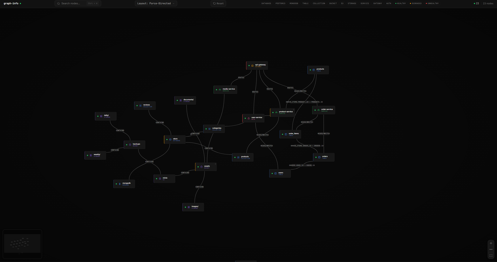

<div align="center">

# graph-go

**See your infrastructure. Zero Config.**

Point graph-go at your stack and get a live, interactive map of every database, table, service, and storage bucket — with real-time health monitoring.

[](https://www.gnu.org/licenses/agpl-3.0)


</div>

---

graph-go is a **CLI-first infrastructure mapper**. It auto-discovers your infrastructure by connecting to the Docker daemon, inspecting running containers, and probing databases and storage services. The UI is served by the backend and reflects real backend state — no manual inventory needed.

| Capability | Details |
|---|---|
| **Auto-discovery** | Detects infrastructure from Docker containers and Kubernetes clusters — no manual inventory needed |
| **Kubernetes** | Namespaces, Deployments, StatefulSets, DaemonSets, Pods, Services — with informer-based real-time watching |
| **Docker** | Classifies running containers, extracts credentials, watches Docker events, honors `graphgo.*` labels to override type/DSN/node-type/name or ignore a container |
| **PostgreSQL** | Tables, foreign key relationships, schema topology |
| **MongoDB** | Databases and collections |
| **MySQL** | Tables, foreign key relationships |
| **Redis** | Keyspaces and key distribution |
| **Elasticsearch** | Indices, cluster health, shard status |
| **S3 / MinIO** | Buckets and top-level prefixes |
| **HTTP services** | Health endpoints, dependency mapping between services |
| **Real-time health** | WebSocket-powered live status updates every 5 seconds |
| **Interactive graph** | Swimlane layout, namespace group containers, pan/zoom, filter by type/health, search nodes |

### Docker labels

graph-go respects a small set of `graphgo.*` container labels (set them on any container you want to control):

| Label | Effect |
|---|---|
| `graphgo.ignore=true` | Skip this container entirely |
| `graphgo.type=postgres` | Force the adapter type (`postgres`, `mongodb`, `mysql`, `redis`, `elasticsearch`, `s3`, `http`) |
| `graphgo.dsn=...` | Inject a connection string (DSN for postgres/mysql, URI for mongodb, falls back to `dsn` otherwise) |
| `graphgo.node-type=gateway` | Override the visual node type (`service`, `gateway`, `auth`, `api`, `queue`, `cache`) |
| `graphgo.name=...` | Override the node name shown in the graph and used in node IDs / logs |

Use these to rescue misclassified containers, point graph-go at a custom DSN, or hide a container from the graph without removing it.

---

## Quick Start — try it in 30 seconds

Boot the seeded demo stack with the CLI. This is the fastest way to see graph-go against a realistic environment and the intended onboarding path for first-time users:

```bash
git clone https://github.com/guilherme-grimm/graph-go.git
cd graph-go
go run ./cmd/app demo
```

Open **http://localhost:8080**. The command runs attached via Docker Compose. Press `Ctrl+C` to stop the attached session.

The first run can take several minutes on a cold machine because Docker may need to pull base images and build the local demo images. Later runs are much faster.

The demo stack expects these host ports to be free: `8080`, `5432`, `27017`, `9000`, and `9001`.

If you need an explicit teardown afterward:

```bash
docker compose -f docker-compose.demo.yml down
```

---

## Run against your own stack

One container, one port. Mount the Docker socket read-only and graph-go auto-discovers everything running on the host:

```bash
docker run -d -p 8080:8080 \
  -v /var/run/docker.sock:/var/run/docker.sock:ro \
  ghcr.io/guilherme-grimm/graph-go:latest
```

> graph-go only reads from the Docker socket. The `:ro` flag enforces this — keep it.

Open **http://localhost:8080**. Auto-discovery handles Docker containers and (when a kubeconfig or in-cluster service account is present) Kubernetes resources without any config file.

For services that live outside Docker/Kubernetes (remote databases, managed cloud services), mount a config file — see [Configuration](#configuration).

---

## Pre-built binary

Single self-contained binary — UI is embedded, but the entrypoint is still the CLI.

```bash
# Linux amd64 (requires the GitHub CLI; browse Releases for other platforms)
gh release download --repo guilherme-grimm/graph-go --pattern 'graph-go_*_linux_amd64.tar.gz' --clobber
tar xzf graph-go_*_linux_amd64.tar.gz
./graph-go serve   # or just `./graph-go` - same thing
```

Open **http://localhost:8080**. Other platforms on the [Releases page](https://github.com/guilherme-grimm/graph-go/releases).

---

## Commands

| Command | What it does |
|---|---|
| `graph-go demo` | Boot the seeded Docker Compose demo stack from the repository and stream its output in the foreground. |
| `graph-go serve` | Start the HTTP server with auto-discovery and live updates (default - same as running with no args). |
| `graph-go scan` | Run discovery once and emit the graph as JSON to stdout. Useful for piping into `jq`, CI checks, or one-shot exports. |
| `graph-go version` | Print version, commit, and build date. |
| `graph-go --health-check` | Hit local `/health` and exit `0`/`1`. Used by the container `HEALTHCHECK`; not for interactive use. |

Global flags (apply to every subcommand): `--config`, `--log-level`, `--log-format`. See `graph-go <command> --help` for the full per-command surface.

Typical flow:

1. `graph-go demo` for a realistic local walkthrough.
2. `graph-go serve` to run against your own infrastructure.
3. `graph-go scan` for one-shot automation, exports, or CI checks.

---

## Ports

| Port | Purpose |
|---|---|
| `8080` | graph-go (UI + API + WebSocket — production) |
| `5173` | Vite dev server (development only — see [CONTRIBUTING.md](CONTRIBUTING.md)) |
| `9001` | MinIO console (demo stack only) |

---

## Configuration

Auto-discovery is the path. Mount the Docker socket and/or run inside a Kubernetes cluster — graph-go discovers your infrastructure with **no config file needed**.

Use the YAML config (`conf/config.yaml`) only as an escape hatch for services that aren't reachable via discovery — remote databases, managed cloud services, external endpoints. See [`conf/config.sample.yaml`](conf/config.sample.yaml) for the full schema — examples for every adapter and every config block (`server`, `docker`, `kubernetes`, `connections`).

To use a config file with the Docker run above:

```bash
docker run -d -p 8080:8080 \
  -v /var/run/docker.sock:/var/run/docker.sock:ro \
  -v $(pwd)/conf/config.yaml:/app/conf/config.yaml:ro \
  ghcr.io/guilherme-grimm/graph-go:latest
```

> **Authorized use only:** graph-go is for visualizing infrastructure you own or have permission to access. Do not point it at systems without authorization.

---

## Architecture Overview

### Backend (Go)

```
                          ┌─────────────────────────────────────┐
                          │         Discoverer Interface         │
                          │  Discover() · Watch() · Close()     │
                          └──────────┬──────────┬───────────────┘
                                     │          │
                          ┌──────────▼──┐  ┌────▼──────────────┐
                          │   Docker    │  │   Kubernetes       │
                          │  Discoverer │  │   Discoverer       │
                          │ (containers,│  │ (informers, pods,  │
                          │  classify,  │  │  deployments,      │
                          │  events)    │  │  services, health) │
                          └──────┬──────┘  └────┬──────────────┘
                                 │               │
                          ┌──────▼───────────────▼──────┐
                          │  Parallel Discovery + Merge  │
                          │  (concatenate ServiceInfo)   │
                          └──────────────┬──────────────┘
                                         │
Config (YAML) ──→ YAML Merge ───────────▶│
                                         ▼
                          ┌─────────────────────────────┐
                          │     Adapter Registry         │
                          │  ├─ PostgreSQL  → Tables + FK│
                          │  ├─ MongoDB    → Collections │
                          │  ├─ MySQL      → Tables + FK │
                          │  ├─ Redis      → Keyspaces   │
                          │  ├─ Elasticsearch → Indices   │
                          │  ├─ S3         → Buckets      │
                          │  └─ HTTP       → Health + deps│
                          │                               │
                          │  + Topology (K8s nodes/edges) │
                          └──────────────┬───────────────┘
                                         ▼
                          Graph Model (Nodes + Edges)
                                         ▼
                          REST API + WebSocket (Real-time)
```

**Key Components:**
- **Discoverer Interface**: Uniform contract (`Discover`, `Watch`, `Close`) for all discovery backends — Docker and Kubernetes run in parallel, results are concatenated
- **Docker Discovery**: Inspects containers, classifies images, extracts credentials from env vars, watches Docker events for live topology changes
- **Kubernetes Discovery**: Uses client-go informers with debounced event handling; discovers Namespaces, Deployments, StatefulSets, DaemonSets, Pods, and Services with health mapping
- **Adapters**: Implement the `Adapter` interface to probe databases and storage services
- **Registry**: Manages adapters and topology sets, creates service-level parent nodes, aggregates graph data
- **Cache**: 30-second TTL with singleflight pattern to prevent thundering herd
- **WebSocket**: Streams health updates every 5 seconds

### Frontend (React + TypeScript)

- **Swimlane Layout**: Namespace-aware layout with zone classification (system, infra, application namespaces)
- **Group Containers**: K8s namespaces render as collapsible bounding boxes via React Flow grouping
- **Node Inspector**: Side panel showing detailed metadata and connections
- **WebSocket Hook**: Real-time health updates without polling

### Node Hierarchy

```
Adapter-discovered:
  Service Node (postgres/mongodb/s3)
      └─ Database/Bucket Node
          └─ Table/Collection/Prefix Node

Kubernetes-discovered:
  Namespace (group container)
      └─ Deployment / StatefulSet / DaemonSet
          └─ Pod
      └─ K8sService ──routes_to──→ Pod
```

Edges represent relationships (`contains`, `foreign_key`, `routes_to`, etc.).

---

## Tech Stack

**Backend:**
- Go 1.25.6
- gorilla/mux (HTTP routing)
- k8s.io/client-go (Kubernetes discovery + informers)
- pgxpool (PostgreSQL)
- mongo-driver v2 (MongoDB)
- go-sql-driver/mysql (MySQL)
- go-redis/v9 (Redis)
- go-elasticsearch/v8 (Elasticsearch)
- AWS SDK v2 (S3)
- coder/websocket (WebSocket)
- testcontainers-go (integration tests)

**Frontend:**
- TypeScript
- React 19
- @xyflow/react v12 (graph visualization)
- Vite (build tool)

**Infrastructure:**
- Docker + Docker Compose
- PostgreSQL 17
- MongoDB 7
- MySQL 8
- Redis 7
- Elasticsearch 8
- MinIO (S3-compatible)

---

## Testing

### Unit Tests

```bash
go test ./...
```

Runs without Docker. Includes pure function tests and HTTP handler tests.

### Integration Tests

```bash
go test -tags=integration -v -timeout=5m ./internal/adapters/...
```

Requires Docker. Uses [testcontainers-go](https://golang.testcontainers.org/) to spin up real database instances (PostgreSQL, MongoDB, MySQL, Redis, Elasticsearch, MinIO) — no mocks.

Every adapter runs through the **contract test suite** (`adaptertest.RunContractTests`) which validates:
- Connect/disconnect lifecycle
- Node/edge discovery (unique IDs, valid parent refs, correct types)
- Health metrics (status key, required keys)

Run a single adapter's tests:

```bash
go test -tags=integration -v ./internal/adapters/redis/
```

### All Tests

```bash
make test  # unit + type-check
go test -tags=integration -timeout=5m ./internal/adapters/...  # integration
```

---

## API Reference

### GET `/api/graph`
Returns the full infrastructure graph (nodes + edges).

**Response:**
```json
{
  "data": {
    "nodes": [
      {
        "id": "service-postgres",
        "type": "postgres",
        "name": "postgres",
        "metadata": { "adapter": "postgres" },
        "health": "healthy"
      }
    ],
    "edges": [
      {
        "id": "edge-1",
        "source": "service-postgres",
        "target": "pg-mydb",
        "type": "contains",
        "label": "contains"
      }
    ]
  }
}
```

### GET `/api/node/{id}`
Returns details for a specific node.

### GET `/api/health`
Returns adapter health status (ok/degraded/error).

### WS `/websocket`
Streams real-time updates. Two message types are emitted, both wrapped as `{ "type": "...", "payload": { ... } }`. There is no `timestamp` field — clients infer ordering by arrival.

**`health_update`** — sent for every node once per sweep (every 5s). Adapter-owned nodes get health via the adapter lookup; topology nodes (e.g. Kubernetes resources) carry health directly on the node.
```json
{
  "type": "health_update",
  "payload": {
    "nodeId": "service-postgres",
    "health": "healthy"
  }
}
```
`health` is one of `healthy`, `degraded`, `unhealthy`.

**`graph_update`** — sent when the set of node IDs changes (a node was added or removed by discovery). `payload` is empty; clients should re-fetch `/api/graph`.
```json
{
  "type": "graph_update",
  "payload": {}
}
```

---

## Adding a New Adapter

1. **Create adapter package** in `internal/adapters/{name}/`
2. **Implement the `Adapter` interface:**
   ```go
   type Adapter interface {
       Connect(config ConnectionConfig) error
       Discover() ([]nodes.Node, []edges.Edge, error)
       Health() (HealthMetrics, error)
       Close() error
   }
   ```
3. **Add integration tests** (required) — create `{name}_integration_test.go` with:
   - Build tag `//go:build integration`
   - `TestMain` using testcontainers-go to start a real instance
   - Seed representative data
   - Call `adaptertest.RunContractTests` to validate the interface contract
   - Add adapter-specific tests (filtering, ID format, metadata, etc.)
4. **Add one entry** to `Default()` in `internal/adapters/catalog/catalog.go` — the only place adapters are registered
5. **Add node type** in `internal/graph/nodes/nodes.go`
6. **Update frontend types** in `webui/src/types/graph.ts`
7. **Add icon** in `webui/src/components/graph/CustomNode.tsx`

## Adding a New Discoverer

Discoverers live in `internal/discovery/{name}/` and implement the `Discoverer` interface:

```go
type Discoverer interface {
    Name() string
    Discover(ctx context.Context) ([]ServiceInfo, error)
    Watch(ctx context.Context, onChange func()) error
    Close() error
}
```

1. **Create discoverer package** in `internal/discovery/{name}/`
2. **Implement the `Discoverer` interface** — return `[]ServiceInfo` from `Discover()`. Topology-producing discoverers (like K8s) populate `Nodes`/`Edges` directly; adapter-oriented ones (like Docker) populate `Config` for adapter bridging.
3. **Wire into server** in `internal/server/server.go` — add a `build{Name}Discovery()` function and call it alongside the existing discoverers.
4. **Add integration tests** with `//go:build integration` — use real infrastructure (kind/k3d for K8s, testcontainers for others). No mocks.

See `CONTRIBUTING.md` for detailed guidance.

---

## Contributing

We welcome contributions! See [CONTRIBUTING.md](CONTRIBUTING.md) for guidelines on:
- Development setup
- Code style conventions
- How to add new adapters
- Submitting pull requests

---

## Use Scope & Ethics

**Intended Use:**
- Visualizing and monitoring infrastructure you own or have authorization to access
- DevOps dashboards and topology mapping
- Infrastructure documentation and onboarding
- Exploring database schemas and relationships

**Not Intended For:**
- Unauthorized system scanning or reconnaissance
- Security testing without explicit permission
- Accessing systems you don't own or control

Users are responsible for ensuring they have proper authorization before connecting graph-go to any infrastructure.

---

## License

This project is licensed under the **GNU Affero General Public License v3.0 (AGPL-3.0)**.

See the [LICENSE](LICENSE) file for details. AGPL requires that modified versions used over a network must also be open-sourced.

---

## CI/CD & Releases

The project uses GitHub Actions for continuous integration and automated releases.

- **CI** runs on every push/PR to `main` — backend unit tests, integration tests (testcontainers), and frontend build
- **Releases** are triggered by version tags (`v*`) and produce:
  - Cross-platform binaries (Linux, macOS, Windows) via [GoReleaser](https://goreleaser.com)
  - Single Docker image pushed to `ghcr.io/guilherme-grimm/graph-go`

To create a release:
```bash
git tag v0.1.0
git push --tags
```

---

## Roadmap

- [x] Docker auto-discovery
- [x] HTTP service health monitoring
- [x] MySQL adapter
- [x] Redis adapter
- [x] Elasticsearch adapter
- [x] Integration tests with testcontainers-go (all adapters)
- [x] Contract test suite for adapter interface compliance
- [x] Discoverer interface (pluggable discovery backends)
- [x] Kubernetes orchestrator (Namespaces, Deployments, StatefulSets, DaemonSets, Pods, Services)
- [x] Informer-based real-time K8s watching with debounce
- [x] Swimlane layout with namespace group containers
- [ ] K8s adapter bridging (classify pods by image, connect adapters to databases in pods)
- [ ] Flow observability (real-time data flow visualization)
- [ ] Integrated stress trigger (k6 with real-time impact visualization)
- [ ] Kafka adapter
- [ ] Additional orchestrators (ECS, Nomad)
- [ ] Graph persistence (save/load views)
- [ ] Multi-region visualization
- [ ] Alert configuration per node

---

## Support

- **Issues**: [github.com/guilherme-grimm/graph-go/issues](https://github.com/guilherme-grimm/graph-go/issues)
- **Discussions**: [github.com/guilherme-grimm/graph-go/discussions](https://github.com/guilherme-grimm/graph-go/discussions)

---

**Built with ❤️ for DevOps and infrastructure engineers**
